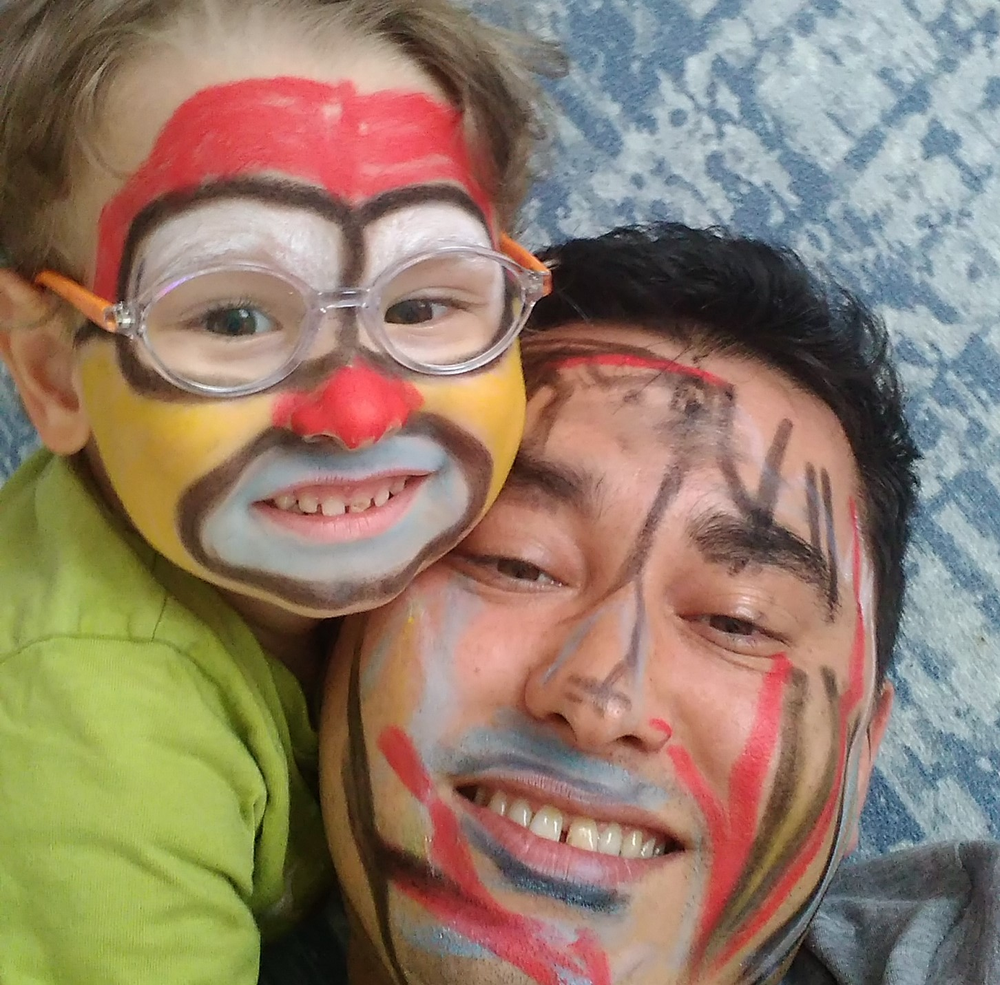
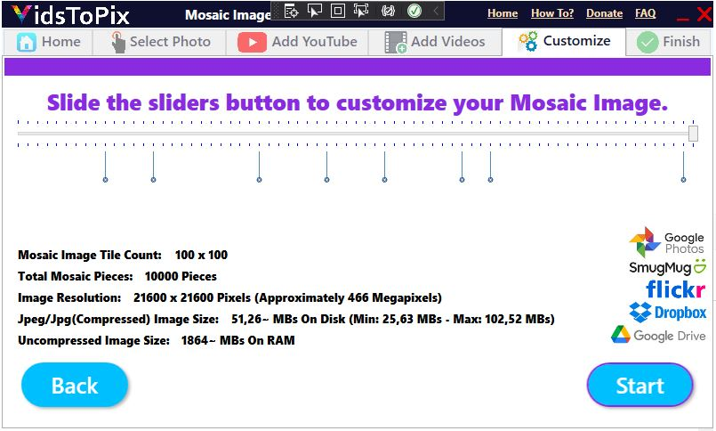
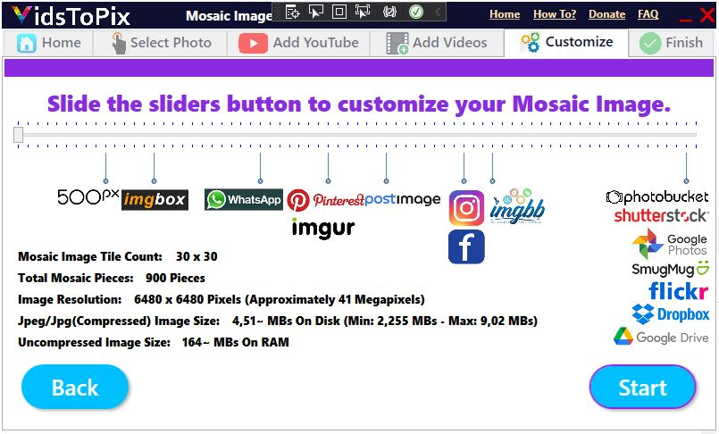
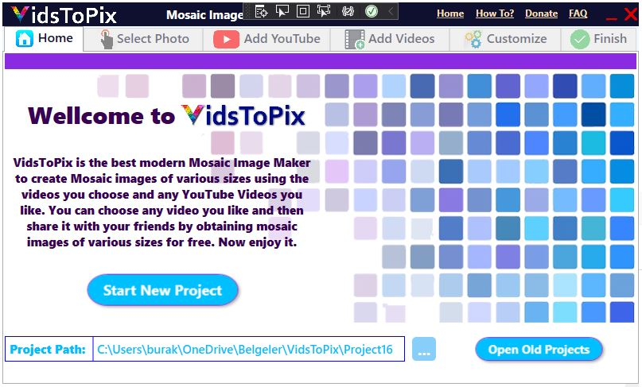

# VidsToPix

## Example Result

## Original

## Maximum Output Example

## User Interface

# VidsToPix

Ultra-high-resolution photomosaic generator from youtube and local video frames, built with C# WPF.

The application allows users to create large mosaic images from YouTube videos and local video files by rebuilding a target image using thousands of extracted video frames.

Originally developed in **2021**, VidsToPix combines image processing, video analysis, multithreading, project management, and high-resolution image generation into a complete desktop application.

---

# Features

* Create photomosaic images from video frames
* Use YouTube videos as frame sources
* Use local video files as frame sources
* Create and reopen saved projects
* Automatic video frame extraction
* RGB-based frame matching algorithm
* Adjustable mosaic size
* Real-time output resolution estimation
* Real-time RAM usage estimation
* Real-time file size estimation
* Parallel processing for faster generation
* High-resolution image generation
* Social media sharing support

---

# User Workflow

### 1. Create or Open a Project

Users can start a new project or reopen a previously created project.

### 2. Select a Target Image

The image selected in this step becomes the final image that will be reconstructed as a photomosaic.

### 3. Add a YouTube Video (Optional)

Users may add a YouTube video to serve as a frame source.

To keep processing times reasonable, YouTube videos are limited to 15 minutes.

### 4. Add Local Videos

Users can add local video files from their computer.

Supported formats:

* MP4
* AVI
* MPG
* MPEG

A maximum of 5 videos can be added and the total duration is limited to 15 minutes.

### 5. Customize Mosaic Size

Users can select the mosaic density using a slider.

Supported sizes range from:

* 30 × 30 tiles
* up to 100 × 100 tiles

Before generation begins, the application calculates:

* Total mosaic pieces
* Output resolution
* Estimated file size
* Estimated RAM consumption

This helps users choose an output size suitable for social media platforms and image hosting services.

### 6. Generate the Mosaic

The application extracts frames from all source videos.

For each frame:

* Average RGB values are calculated.
* The target image is analyzed.
* The closest matching frame is selected.

The final mosaic image is then generated using multithreaded processing.

### 7. Preview and Share

After generation:

* The resulting image can be previewed.
* The full-size image can be opened.
* Users can directly access supported image sharing platforms.

---

# Example Output Capacity

Maximum configuration:

* Mosaic Grid: 100 × 100
* Total Mosaic Pieces: 10,000
* Output Resolution: 21,600 × 21,600 pixels
* Approximate Output Size: 466 Megapixels
* Estimated RAM Usage: ~1.8 GB

Generation typically completes in around 30 seconds and rarely exceeds 1.5 minutes on supported hardware.

---

# Technical Details

### Color Matching

Each extracted video frame is analyzed and its average RGB color is calculated.

The target image is then processed pixel-by-pixel (or tile-by-tile), and the closest matching frame is selected based on RGB similarity.

### Performance

To speed up image generation, the project uses multithreaded processing techniques, including parallel execution, allowing thousands of image comparisons to be processed efficiently.

---

# Historical Context

VidsToPix was originally developed in 2021, before the widespread adoption of AI coding assistants such as ChatGPT, GitHub Copilot, Claude, and similar tools.

The project was researched, designed, coded, tested, and completed manually using traditional software development practices.

This repository therefore represents an authentic snapshot of an independently developed image-processing project from that period.

---

# Why This Project Was Open-Sourced

VidsToPix was originally developed as a personal software product and reached a fully functional state in 2021.

Although the application worked successfully and produced high-quality results, I never managed to dedicate enough time and resources to marketing, distribution, and commercial development as a solo developer.

Rather than leaving the project archived on a hard drive, I decided to publish it on GitHub several years later so that other developers can explore, learn from, improve, or simply enjoy the project.

---

# Technologies Used

* C#
* WPF
* .NET Framework
* YoutubeExplode
* MediaToolkit
* Multithreading
* Parallel Processing

---

# License

MIT License
